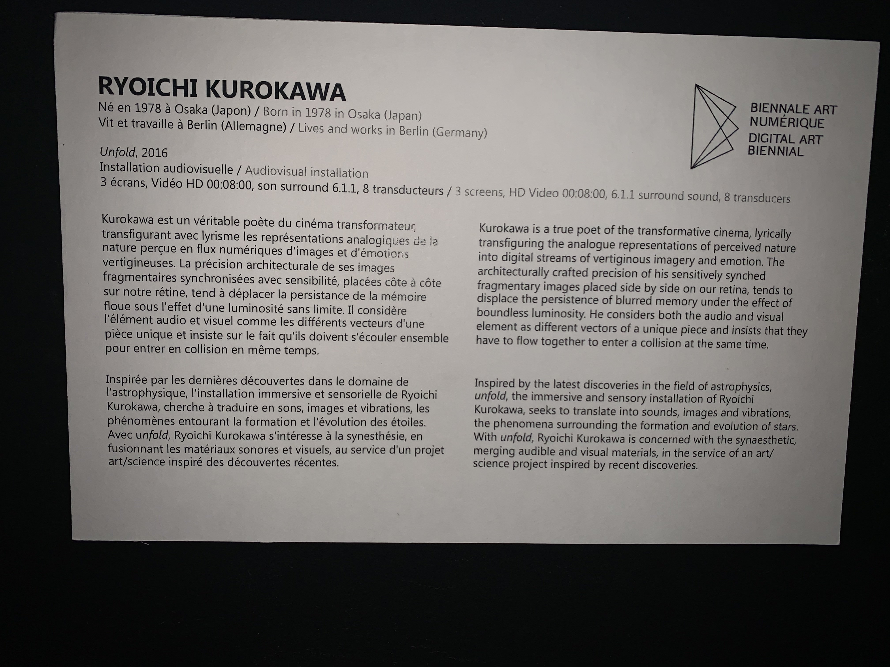
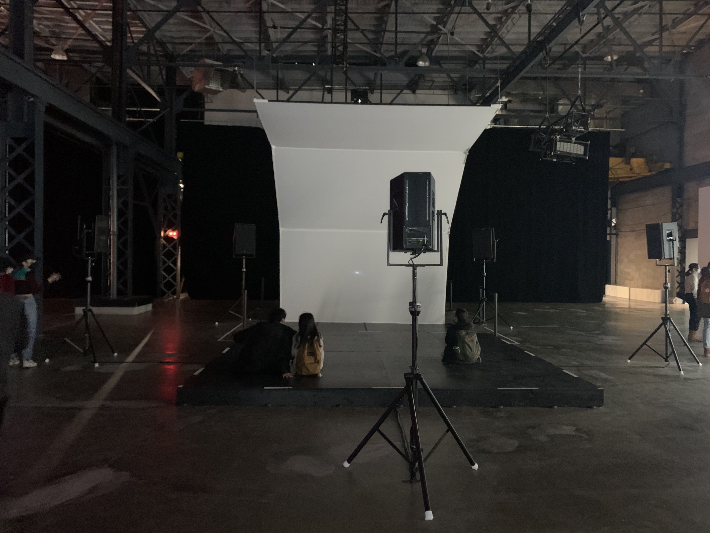
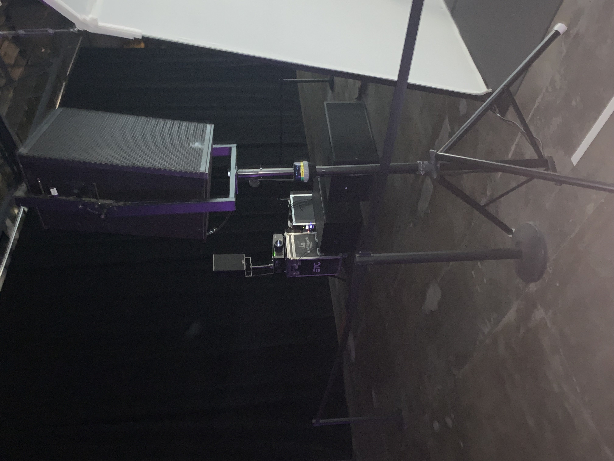
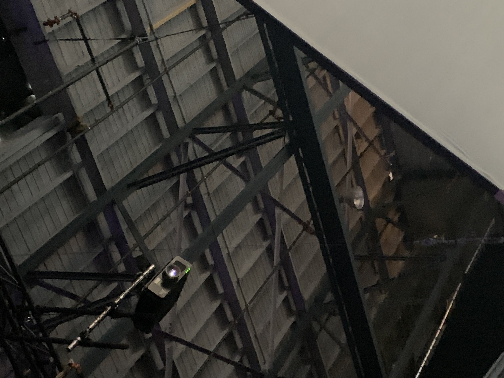
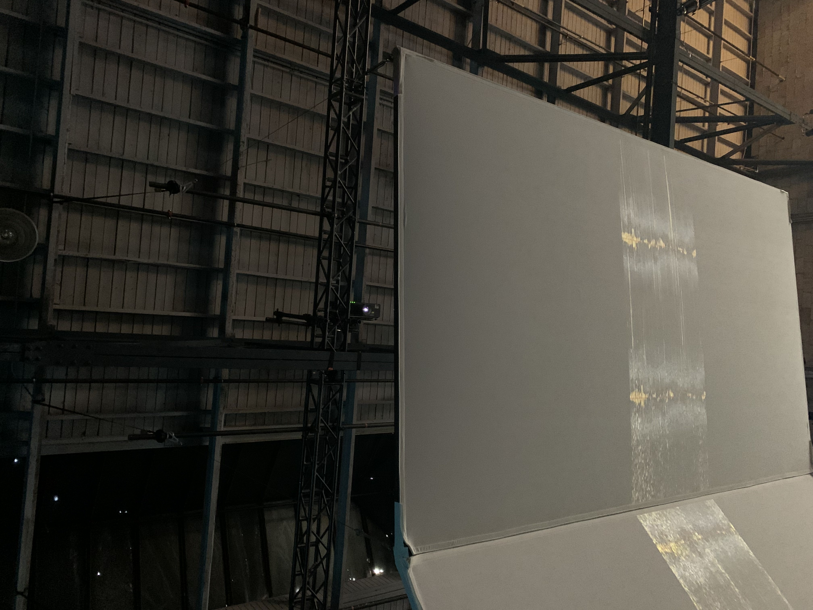
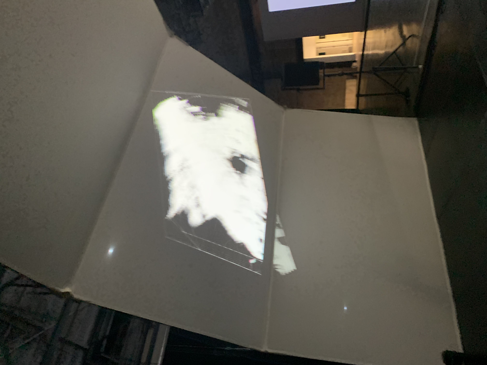
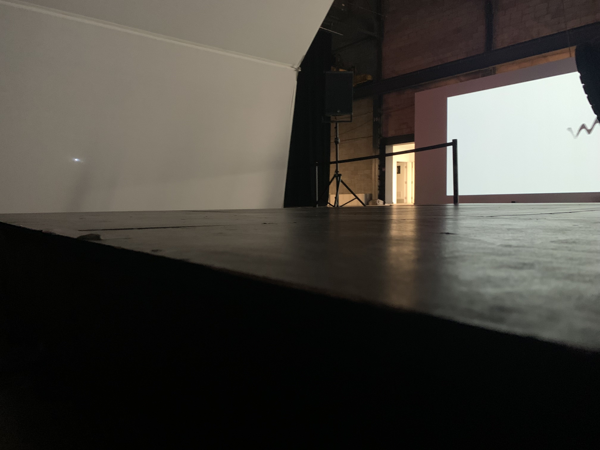
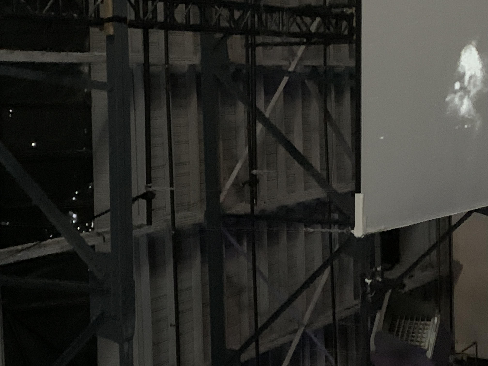
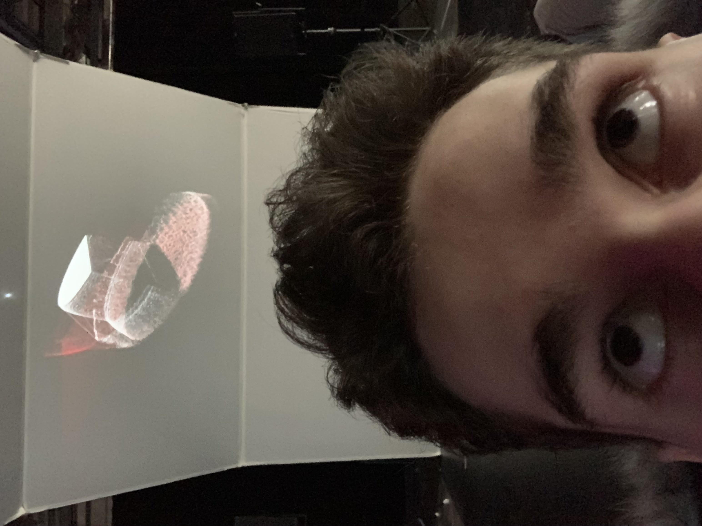
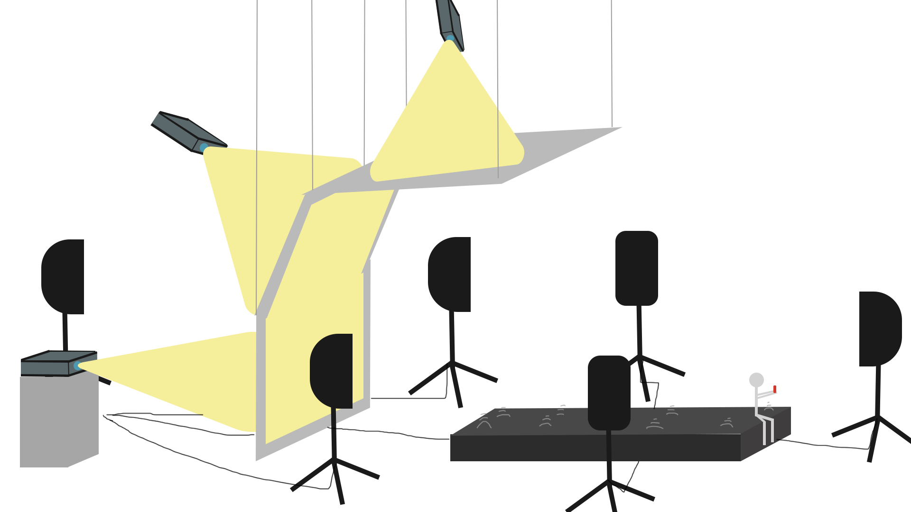

# Titre de l'oeuvre ou de la réalisation
*Unfold*
## Nom de l'artiste ou de la firme
Ryoichi Kurokawa 
## Année de réalisation
2016
## Nom de l'exposition ou de l'événement
Biennale Art Numérique
## Lieu de mise en exposition
Montréal, Québec. L'Arsenal
## Date de votre visite
9 février 2022
## Description de l'oeuvre ou du dispositif multimédia (à composer ou reprendre la description offerte sur le site de l'artiste ou le cartel de l'exposition en citant bien sa source)
(Ce texte est tiré du cartel d'expo)

Kurokawa est un véritable poète du cinéma transformateur, transfigurant avec lyrisme les représentations analogiques de la nature perçue en flux numériques d'images et d'émotions vertigineuses. La précision architecturale de ses images fragmentaires synchronisées avec sensibilité, placées côte à côte sur notre rétine, tend à déplacer la persistance de la mémoire floue sous l'effet d'une luminosité sans limite. Il considère l'élément audio et visuel comme les différents vecteurs d'une pièce unique et insiste sur le fait qu'ils doivent s'écouler ensemble pour entrer en collision en même temps. Inspirée par les dernières découvertes dans le domaine de l'astrophysique, l'installation immersive et sensorielle de Ryoichi Kurokawa, cherche à traduire en sons, images et vibrations, les phénomènes entourant la formation et l'évolution des étoiles. Avec unfold, Ryoichi Kurokawa s'intéresse à la synesthésie, en fusionnant les matériaux sonores et visuels, au service d'un projet art/science inspiré des découvertes récentes.

## Explications sur la mise en espace de l'oeuvre ou du dispositif (texte à composer)
Derrière chacune des 3 toiles était placé un projecteur afin de projecteur la vidéo au travers la toile. Chaque projecteur jouait la vidéo différente des autres afin de créer un seul écran jouant une seule vidéo qui immergeait toutes les toiles. Ensuite, 6 haut-parleurs étaient disposés autour du lieu de visionnage afin de créer un son surround 6.1.1: un en arrière, deux en angle en arrière de chaque côté, devant en angle de chaque côté et le dernier en arrière de la toile. Finalement, la base en bois servant de l'espace de visionnage était constituée de 8 transducteurs placés à l'intérieur. Le rôle de ceux-ci était de créer la vibration dans les pieds. 
# Liste des composantes et techniques de l'oeuvre ou du dispositif (ex. : réalité virtuelle, projecteurs, caméra USB, anneau lumineux...)
3 grandes toiles servant d'écrans pour les 3 projecteurs, vidéo d'immersion de 8 minutes, 6 haut-parleurs pour du surround 6.1.1, 8 transducteurs.
     
## Liste des éléments nécessaires pour la mise en exposition (ex. : crochets, sac de sable, câbles de soutien...)
3 grandes toiles blanches rectangulaires firent disposés verticalement de façon à créer une forme parabolique. Pour s'y faire, deux d'entre eux sont suspendus à l'aide de câble de métal très solide, une disposé en angle afin de coller la toile au sol et celle à plat en l'air. Afin de rendre les fils électriques plus discrets, ils furent tous collés avec du ruban noir sur le plancher. La console de son était placée en arrière des toiles. 
## Expérience vécue :
L'expérience étant de ressentir la basse et le son vibrant dans le corps qui accompagne cette courte vidéo démontrant l'évolution des étoiles.
### - Description de votre expérience de l'oeuvre ou du dispositif, de l'interactivité, des gestes à poser, etc.
La sensation des basses vibrantes dans tout le corps rendait cette expérience à couper le souffle. Parfois, mon corps s'emballait tellement que le battement de mon cœur en accélérait au fur et à mesure que les images et la musique s'intensifiassent. 
### - ❤️ Ce qui vous a plu, vous a donné des idées et justifications
J'ai bien aimé la synchronisation des images avec la musique et la basse, cela m'en donnait fréquemment des frissons. J'ai toujours été un adepte aux basses fréquences que ce soit pour la musique ou les films. 

### - 🤔 Aspect que vous ne souhaiteriez pas retenir pour vos propres créations ou que vous feriez autrement et justifications
Un aspect primordial que je ferai autrement si j'avais à créer une telle œuvre, cela serait la mise en exposition. En effet, je n'ai pas aimé le fait que cette œuvre fut au milieu de la grande salle, grand ouvert, sans le moindre mur. À cause de ceci, il était parfois difficile de se concentrer sur la vidéo parce qu'il y avait trop de bruit des gens qui admiraient les autres œuvres aux alentours. À la place, j'installerais mon œuvre dans une pièce fermée et plongée dans le noir afin de rendre l'expérience encore meilleure que jamais. 

## Références
http://www.digiart21.org/art/unfold
https://www.stereolux.org/agenda/unfold-ryoichi-kurokawa-constrained-surface-ryoichi-kurokawa
