⚠ Les informations sont très limitées et le site officiel du Cosomodôme de Laval ne mentionne aucune des petites expositions.⚠  

# Titre de la réalisation
La Terre vue d'en haut[?]
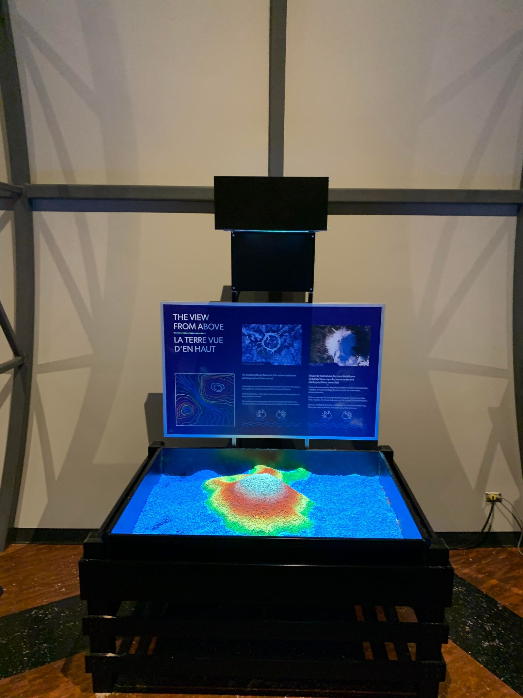
## Nom de l'artiste ou de la firme
*Non mentionné*
## Année de réalisation
*Non mentionné*
## Nom de l'exposition ou de l'événement
Objectif Terre : Comprendre notre planète depuis l’espace
## Lieu de mise en exposition
2150, autoroute des Laurentides, Laval, QC, H7T 2T8
## Date de votre visite
23 mars 2022
## Description de l'oeuvre ou du dispositif multimédia (à composer ou reprendre la description offerte sur le site de l'artiste ou le cartel de l'exposition en citant bien sa source)
(Ce texte est tiré du cartel)

*Essaie de reproduire les caractéristiques géographiques que les astronautes ont photographiées en orbite!*

*Comme les astronautes à bord de la Station spatiale internationale voient la Terre de très haut, ils ont un point de vue unique de notre planète.*

*Crée un paysage. Et si tu regardes ton paysage comme si tu étais
dans l'espace, est-ce que tu trouves qu'il a changé? De quelle façon?*

*Découvre l'effet du relief de ton paysage sur l'écoulement de l'eau.*
*Place une main au-dessus de la table pour faire pleuvoir.*
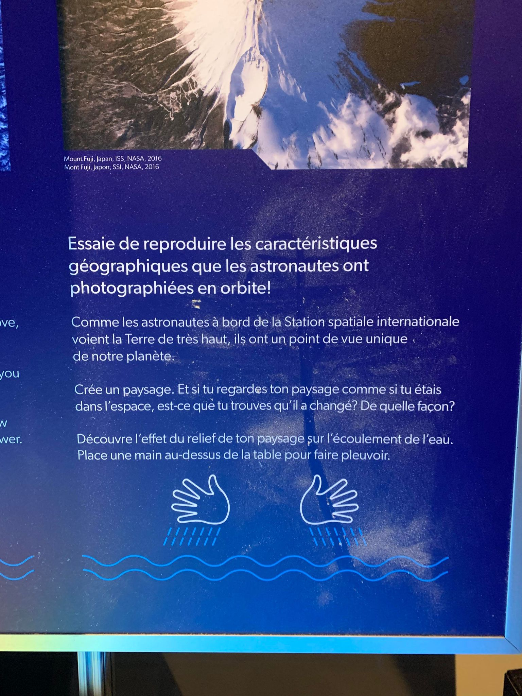
## Explications sur la mise en espace de l'oeuvre ou du dispositif (texte à composer)
Les visiteurs sont invités à créer des piles de papiers avec leurs mains afin de simuler des montagnes. Le projecteur détectera la hauteur de chacune des piles et changera la couleur dépendamment de si elles sont petites ou grandes (cyan, turquoise, vert, jaune, rouge, blanc). De plus, lorsqu'une main s'immobilise au-dessus du niveau du papier, le projecteur simulera les nuages qui se déplacent lors d'une pluie. 
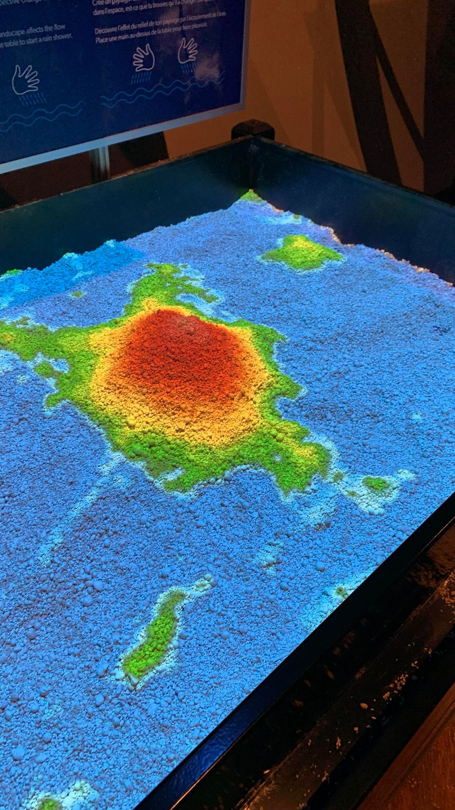 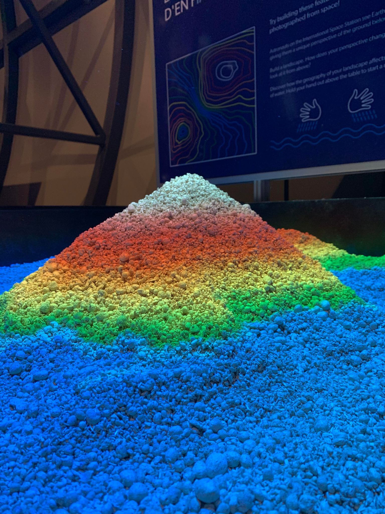 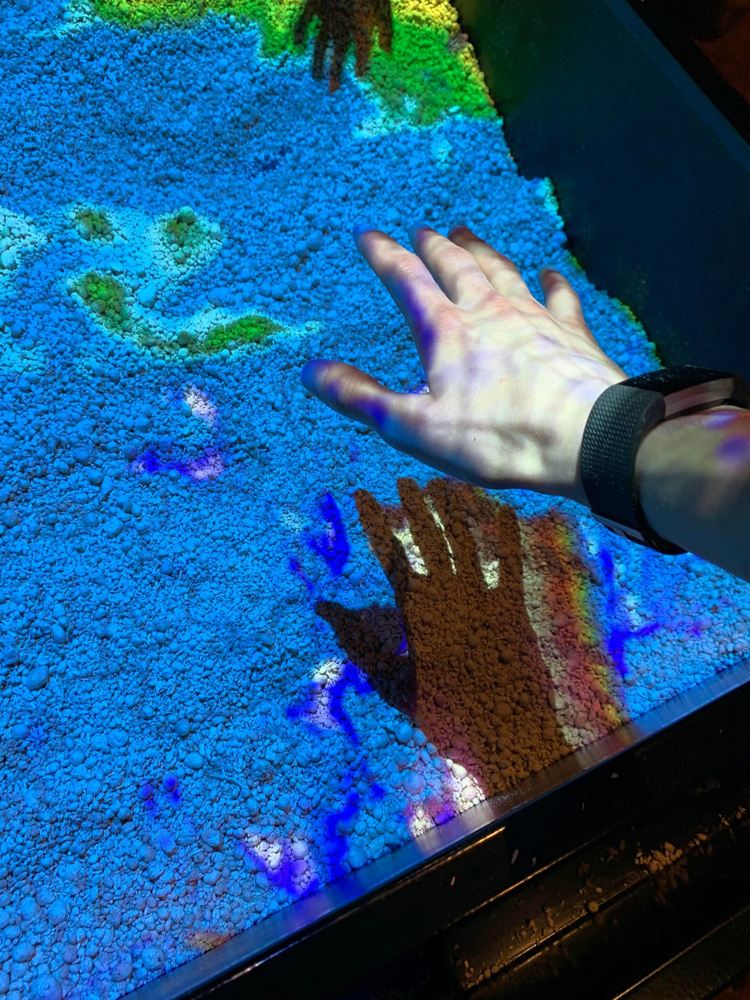
## Liste des composantes et techniques de l'oeuvre ou du dispositif (ex. : réalité virtuelle, projecteurs, caméra USB, anneau lumineux...)
Projecteur 
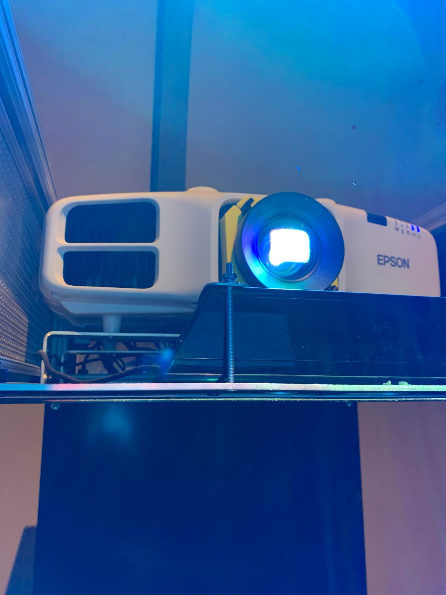
## Liste des éléments nécessaires pour la mise en exposition (ex. : crochets, sac de sable, câbles de soutien...)
Base en métal avec creux au centre, miroir, boules de papiers/cartons, boitier électrique.
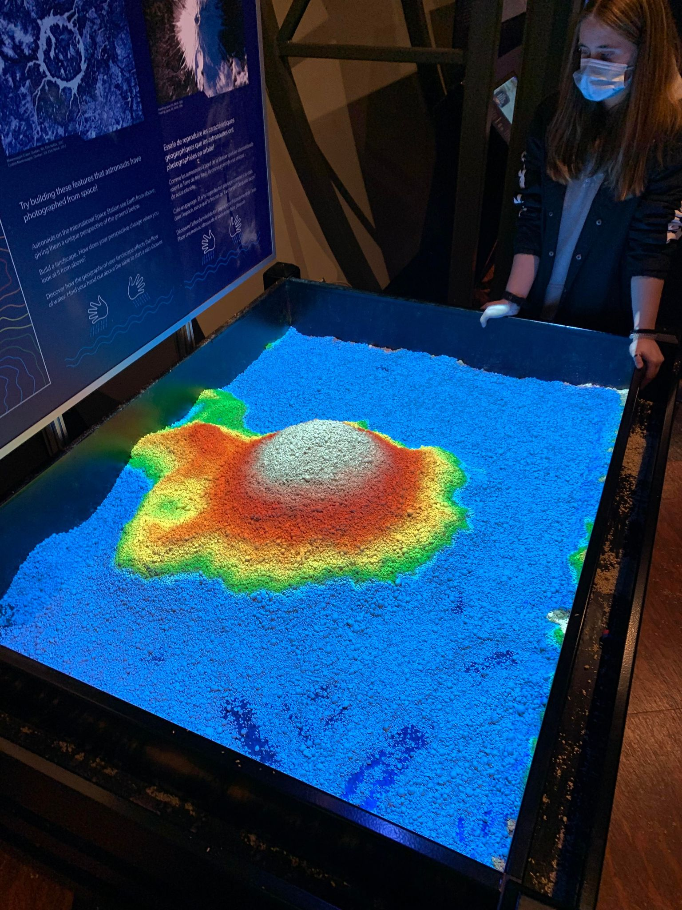 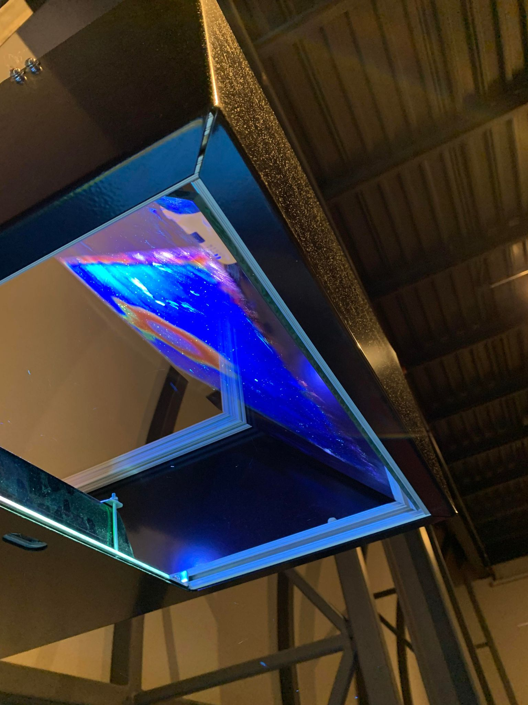 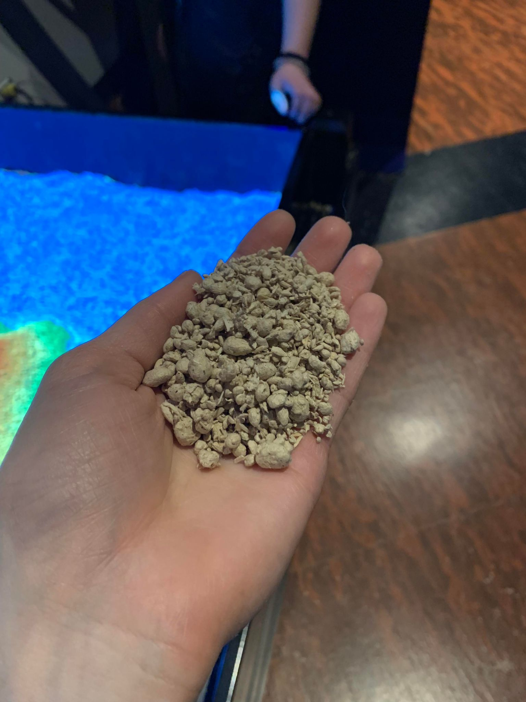 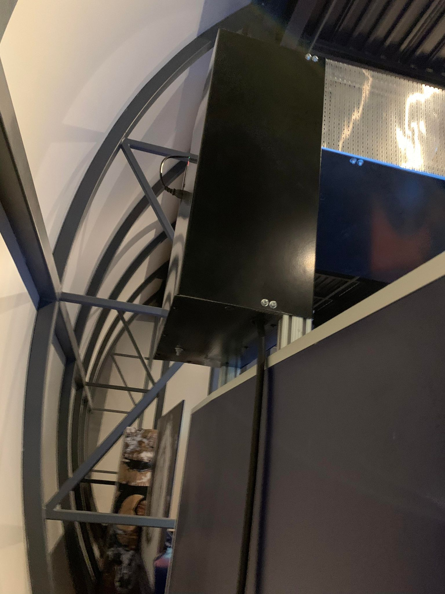
## Expérience vécue :
Faire inspirer et découvrir la vue des montagnes et des nuages depuis une vue d'en haut.
### - Description de votre expérience de l'oeuvre ou du dispositif, de l'interactivité, des gestes à poser, etc.
C'était une expérience très amusante, comme le démoigne l'image ci-dessous. Cela m'a beaucoup fasciner comment le projecteur peut déterminer la hauteur de quelque chose depuis seulement la vue du dessus. Et encore, j'ai été supris lorsqu'il a détecter ma main et qu'il déclencher une pluie.
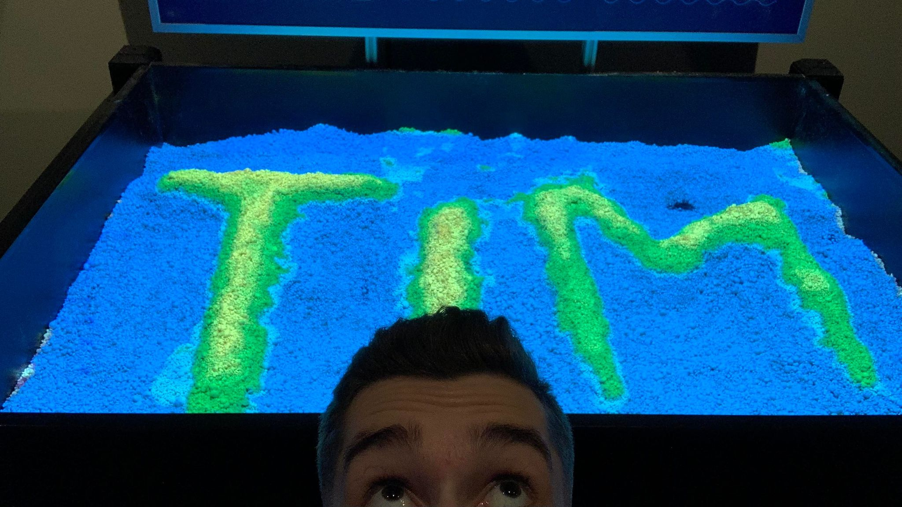
### - ❤️ Ce qui vous a plu, vous a donné des idées et justifications
Ce que j'ai le plus aimé de ce dernier c'est qu'il puisse s'adapter, c'est-à-dire qu'au fur et à mesure des actions le projecteur réévalue la zone et il changera au besoin, contrairement à une simple maquette avec des reliefs et une image fixe avec des zones de couleurs prédessiner. L'interaction est là, et c'est ça que j'aime.
### - 🤔 Aspect que vous ne souhaiteriez pas retenir pour vos propres créations ou que vous feriez autrement et justifications
Cela va paraitre bizarre comme réponse, mais je ne souhaiterais pas que mon nom ne soit pas mentionné sur mes œuvres, parce que lorsqu'on crée quelque chose d'original, je trouve qu'il est important de laisser sa trace. Ainsi, j'écrirais mon nom quelque part sur le cartel.
## Références
https://cosmodome.org/une-nouvelle-exposition-temporaire-au-cosmodome-communique-de-presse/
https://cosmodome.org/
