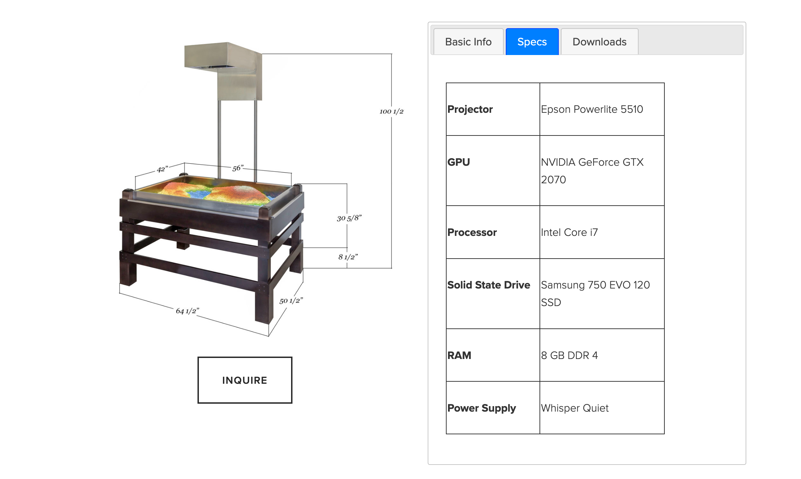

# TopoBox

## Nom de l'artiste ou de la firme
Reactive Digital Systems
## Année de réalisation
*Non mentionné*
## Nom de l'exposition ou de l'événement
Objectif Terre : Comprendre notre planète depuis l’espace
## Lieu de mise en exposition
Cosmodôme de Laval, laval, québec
## Date de votre visite
23 mars 2022
## Description de l'oeuvre ou du dispositif multimédia (à composer ou reprendre la description offerte sur le site de l'artiste ou le cartel de l'exposition en citant bien sa source)
(Ce texte est du site web officel de la compagnie)

TopoBox est un outil extrêmement attrayant qui passionne les enfants et les adultes en enseignant diverses propriétés de la topographie, de l'hydrologie, de la géomorphologie et de la gestion des terres. Pour utiliser la TopoBox, déplacez simplement le sable et regardez-le changer pour le nouvel environnement. Vous pouvez créer différentes formations géographiques, des montagnes aux vallées en passant par les deltas des rivières et les plaines inondables, et regarder l'eau s'accumuler et s'écouler sur divers bassins versants.

## Explications sur la mise en espace de l'oeuvre ou du dispositif (texte à composer)
Les visiteurs sont invités à créer des piles de papiers/sables avec leurs mains afin de simuler des montagnes. Le scanneur Kinect 3D détectera la hauteur de chacune des piles et changera la couleur dépendamment de si elles sont petites ou grandes (cyan, turquoise, vert, jaune, rouge, blanc). De plus, lorsqu'une main s'immobilise au-dessus du niveau du papier, le projecteur simulera les nuages d'une pluie autour de celle-ci. 
  
## Liste des composantes et techniques de l'oeuvre ou du dispositif (ex. : réalité virtuelle, projecteurs, caméra USB, anneau lumineux...)
Projecteur, scanneur Kinect 3D, ordinateur (tour).

 

## Liste des éléments nécessaires pour la mise en exposition (ex. : crochets, sac de sable, câbles de soutien...)
Un banc en métal et/ou en bois sur pattes, miroir, boules de papiers/sable.
   
## Expérience vécue :
Dans le but d'inspirer et de faire découvrir la vue des montagnes et des nuages depuis une vue d'en haut.
### - Description de votre expérience de l'oeuvre ou du dispositif, de l'interactivité, des gestes à poser, etc.
C'était une expérience très amusante. Cela m'a beaucoup fasciner comment le projecteur peut déterminer la hauteur de quelque chose depuis seulement la vue du dessus. Et encore, j'ai été supris lorsqu'il a détecter ma main et qu'il déclencher une pluie.

### - ❤️ Ce qui vous a plu, vous a donné des idées et justifications
Ce que j'ai le plus aimé de ce dernier c'est qu'il puisse s'adapter, c'est-à-dire qu'au fur et à mesure des actions le projecteur réévalue la zone et il changera au besoin, contrairement à une simple maquette avec des reliefs et une image fixe avec des zones de couleurs prédessiner. L'interaction est là, et c'est ça que j'aime.
### - 🤔 Aspect que vous ne souhaiteriez pas retenir pour vos propres créations ou que vous feriez autrement et justifications
Je ne souhaiterais pas que mon nom ne soit pas mentionné sur mes œuvres, parce que lorsqu'on crée quelque chose d'original, je trouve qu'il est important de laisser sa trace. Ainsi, j'écrirais mon nom quelque part sur le cartel.
## Références
https://cosmodome.org/une-nouvelle-exposition-temporaire-au-cosmodome-communique-de-presse/
https://cosmodome.org/
http://www.topobox.co/
