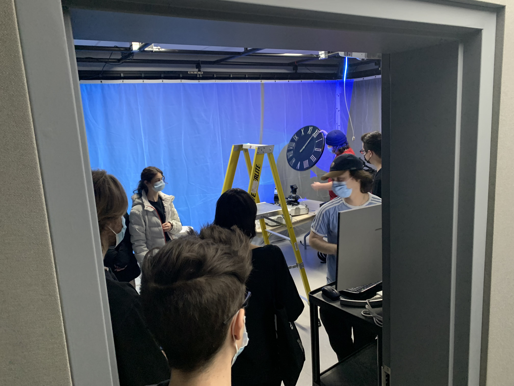
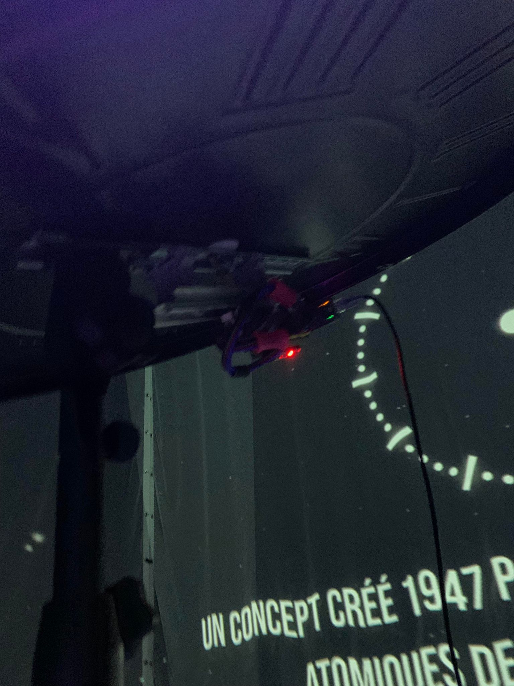

# Titre de l'oeuvre ou de la réalisation
L'horloge de l'apocalypse
## Nom de l'artiste ou de la firme
Maxime Sabourin
Louis-Philippe Gravel
Alexis Lacasse
Tristan Girard-Montpetit
Maxime De Falco
## Année de réalisation
2022
## Nom de l'exposition ou de l'événement
Moebius
## Lieu de mise en exposition
Collège Montmorency, le peit studio.
## Date de votre visite
23 mars 2022
## Description de l'oeuvre ou du dispositif multimédia (à composer ou reprendre la description offerte sur le site de l'artiste ou le cartel de l'exposition en citant bien sa source)
(Information tiré du site de l'exposition)

*L’horloge de l’apocalypse représente la ligne du temps de l’humanité. Selon le concept de l’horloge, il est présentement 11 h 58 et il reste 2 minutes avant la fin de l’humanité. À travers ce projet, l’interacteur est invité à contrôler l’horloge grâce aux aiguilles et ainsi manipuler la ligne du temps. Au cours de l’expérience, vous pourrez vivre les différentes époques auxquelles la terre a été exposée. Vous serez exposé aux différents enjeux actuels à travers la projection qui vous entourera et par le fait même vous plongera dans une immersion totale.*
Source : [tim-montmorency.com](https://tim-montmorency.com/2022/projets/L-horloge-de-l-apocalypse/docs/web/index.html)
## Explications sur la mise en espace de l'oeuvre ou du dispositif (texte à composer)
Un rideau blanc est accroché afin de recouvrir 3 murs sur 4. Avec ce grand espace blanc ainsi que 3 projecteur, une vidéo synchroniser avec les autre projecteurs est projeter. Au centre de la pièce, se trouve une holorge et un téléphone.
  (Croquis tiré sur leur page web) Source : [tim-montmorency.com](https://tim-montmorency.com/2022/projets/L-horloge-de-l-apocalypse/docs/web/index.html)
## Liste des composantes et techniques de l'oeuvre ou du dispositif (ex. : réalité virtuelle, projecteurs, caméra USB, anneau lumineux...)
3 projecteurs, horloge, caméra, téléphone, potentiomètre rotatif à douze encoches, lumière, haut-parleurs.
   
## Liste des éléments nécessaires pour la mise en exposition (ex. : crochets, sac de sable, câbles de soutien...)
4 haut-parleurs ont été placé au 4 coin de la pièce, les fils pour le un potentiomètre est collé au sol avec du ruban noir. Enfin, le potentiomètre rotatif est fixé sous l'horloge.
## Expérience vécue :
L'expérience étant de faire voyager les visiteurs dans le temps à l'aide d'une vidéo de 180 degrés et d'ambiance sonore immersive venant de tout les côtés.
### - Description de votre expérience de l'oeuvre ou du dispositif, de l'interactivité, des gestes à poser, etc.
L'expérience était très original et différente des projets des autres étudiants. L'interactivté avec l'horloge était fascinant, cependant j'aurais bien aimé pouvoir revenir en arrière, mais je pense que c'était le but justement de ne pas pouvoir revenir en arrière. L'interaction avec le téléphone et le message qui a été dit dans celui-ci était très curieux et j'ai bien apprécié. 
### - ❤️ Ce qui vous a plu, vous a donné des idées et justifications
J'ai adoré les musiques sonores qui accompagnait chacune des époques. En plus, le changement de musique lorsqu'on passait au thème suivant était très fluide: Aucune coupure sonore, le niveau sonore était parfaitement balancer entre chacune, il y avait une petit transition d'une musique à l'autre. 

### - 🤔 Aspect que vous ne souhaiteriez pas retenir pour vos propres créations ou que vous feriez autrement et justifications
Cependant, j'ai un peu moins aimé l'animation données aux petit bonhommes ou aux animaux par exemple. Tout leur membre restèrent static, il y avait que seulement des déplacements haut, bas ou des gauches, droites. En gros, je leur aurais donné plus de mouvement et d'articulation.
## Références
- https://tim-montmorency.com/2022/projets/L-horloge-de-l-apocalypse/docs/web/index.html
